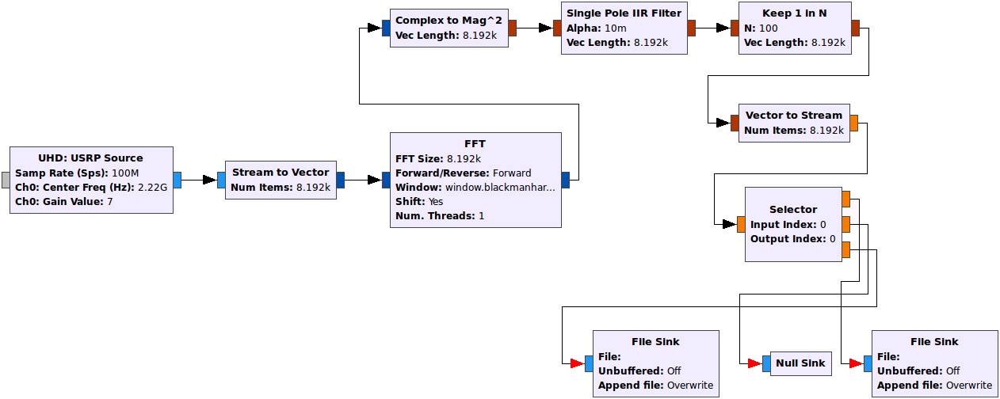

Code explanation
================

This section will give a brief overview of the implementation and the the main python classes, for details please go `here.  <https://github.com/olvhammar/GNURadio-FFTS>`_ The software consists of one socket server module, Server.py, and four classes, Measurement.py, Analyze.py, Receiver.py and finally Finalize.py.
I have been inspired by the SALSA system, created by Eskil Varenius, and you will find similarites in some modules. The code for the SALSA system can be found
`here.  <https://github.com/varenius/salsa>`_

USRP_start.sh
-------------
This is a optimization and initialization script for the GNURadio-FFTS. Creates RAMDisk for sampled data, optimizes GNURadio by
configuring network buffers and starts the PCIE interface as well as the FFTS. ::

	#!/bin/bash
	#Title:	Ettus USRP optimization and storage init
	#Author: Simon Olvhammar

	#Create and mount RAMDisk
	sudo mkdir /tmp/ramdisk
	sudo chmod 777 /tmp/ramdisk
	sudo mount -t tmpfs -o size=16384M tmpfs /tmp/ramdisk

	# Configure Network Buffers
	sudo sysctl -w net.core.rmem_max=33554432
	sudo sysctl -w net.core.wmem_max=33554432

	# Initalize Ettus USRP PCIe drivers
	sudo ~/bin/niusrprio-installer/niusrprio_pcie start

	#Message to User
	echo "Ettus USRP PCIe drivers activated"
	echo "RAMDisk is 8GB in size and located at /tmp/ramdisk"
	echo "Starting GNURadio-FFTS..."
	#Start FFTS
	python /home/olvhammar/GNURadio-FFTS/Software_HRC/Server.py

Server.py
---------
This module is a socket server used to communicate with the receiver and basically just handles commands.
The code is pretty much self explanatory and can be found at the GITHUB pages under Olvhammar/GNURadio-FFTS.

Measurement.py
--------------
This is the most important class in the application since this is the base for the Dicke-switching.
This class controls the Gnuradio flowgraph, Receiver.py, in order to separate the samples corresponding to signal or reference.
Separation of the samples is based upon a switch that is controlled by the state of external SR and DV signals that is transmitted to the GPIO of the Ettus X310. 
It also contains functions such as automatic gain adjustment. The gain adjustment is based on monitoring the raw samples
from the Ettus USRP. The distribution is then checked and gain set accordingly for several loops until the full dynamic range of the A/D converter is covered.

Receiver.py
-----------
Receiver.py is the Gnuradio flowgraph and is best explained using a gnuradio-companion flowgraph. The flowgraph is abit simplified
and the FFTS includes blocks for e.g. sample monitoring, however that would just clutter the graph, but the fundamentals are displayed.
The situation gets a bit more complicated for a two channel setup but the principle is similar.
Se Software_HRC/Receiver.py for details.

	
	GNU Radio flow graph describing a general
	purpose FFT Dicke-switched solution for usage with
	front-ends implementing sky, load or frequency switching.

Basically it computes the Fast Fourier Transform (FFT) from the complex sample stream and saves it to file sinks. A in stream averaging procedure is implemented
through a Single Pole IIR filter. The transfer function can be described by::

	y(n) = (1-a)y(n-1) + ax(n)
	
Which acts as a cheap and convenient way to perform integration. However it does not contain any decimation of it's own why a keep 1 N block is introduced.
Consider the case of a complex sampling rate 120 MSps and a 8192 channel FFT produces approximately 14.6e3 FFT/s. Setting a=1/20 and N=1/a the output of the keep 1 in N block is instead only 732 FFTs/s. 
Thus the implemented python long term integrator stress is greatly reduced along with processing times. For switched measurements it is however extremely important to make a good tradeoff in the selection of a
due to the introduced delay. Ideally a switched measurement should use very small 1/a values. It is however great for SR=DV=1 measurements where a, with great benefits, can be very small.

The stream selector at the sink side is fundamental for the Dicke-switching implementation. The stream will be switched based on the state of RF input. This state, signal or reference,
is controlled by an external switch and it will transmit this information to the GPIO front panel. How this is done in Python can be seen in Measurement.py.

Analyze.py
----------
This class stacks all FFT data and performs averaging.
The switched data is stacked using the function pool.map to better utilize the cores and lower the processing time::

	def stack_all_data(self, files):
		pool = Pool(processes=4)
		spectra = pool.map(self.stack_FFT_file, files)
		pool.terminate()
		return spectra
		
Where self.stack_FFT_file is defined by::
	
	#According to https://github.com/varenius/salsa/tree/master/USRP/usrp_gnuradio_dev
	def stack_FFT_file(self, infile):
		signal = np.memmap(infile, mode = 'r', dtype = np.float32)
		num_spec = int(signal.size/self.fftSize) #The number of spectra contained in the file
		length = num_spec*self.fftSize 
		signal = signal[0:length] #Convert the array to an even number of spectras
		spec = signal.reshape((num_spec, self.fftSize)) #Reshape the array with FFT:s so it can be easily stacked
		spec = spec.sum(axis=0) #Stack the FFT:s
		spec = spec/(1.0*num_spec) #Average Spectrum
		del signal
		return spec
		
Which reads the file containing FFT data and returns one averaged FFT.
Finally the mean value of the stacked FFTs is calculated::

	def mean(self, spectra):
		sum_spec = np.sum(spectra, axis=0, dtype = np.float32)
		return sum_spec/float(len(spectra))
		
Finalize.py
-----------
This class finalizes the measurement and performs e.g. the final averaging and creates FITS-files according to OSO-standards.

Improvements and other toughts
------------------------------
Things I would like to improve, any input would be greatly appreciated.

Processing delays
'''''''''''''''''
Depending on the desired bandwidth the stacking process can take up to 3% of the total measure time, thus introducing a short processing delay between the measurements.
I have greatly reduced the stacking time by the use of threads (i.e. pool.map), however I would like to run the stacking in the background so the stacking procedure can be performed during runtime.
The problem is however restriced to switched measurements since it produces alot of individual files that need be stacked. This is not the case for SR=DV=1.

Alternatives to sync bus switching
''''''''''''''''''''''''''''''''''
Currently the mixer in the front-end of the system is controlled by a sync bus, which in turn sends the state signals (sig or ref) to the GPIO of the Ettus USRP.
The optimal method, with GNU Radios unpredictable processing delay in mind, would be to instead having the software
controlling the mixer instead of external hardware. This would allow for precise sample timing and thus I would be able to remove short delay I have introduced to make sure FFTs do not overlap.
 
