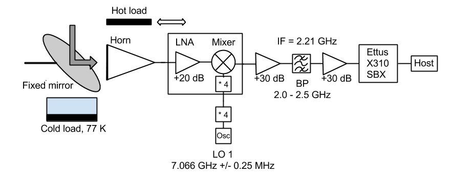
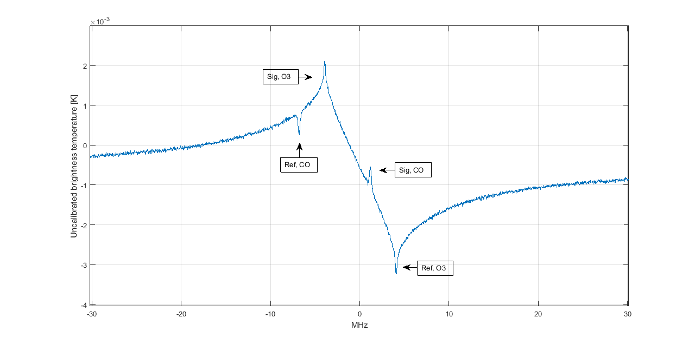

Results and discussion
===============================

A double side band heterodyne receiver front-end designed
at Onsala Space Space Observatory, optimized for
retrieval of mesospheric O3 and CO, is used to test the
GNU-Radio and Ettus USRP Dicke-switched back-end.
An overview of the full receiver chain is provided by the
flow graph in Fig. 3. Details of the receiver front-end and
it’s performance is outlined in [8].
The back-end consist of the Ettus USRP X310 with the
SBX daughterboard and a host computer providing the
GNU Radio interface. The system is used in frequencyswitched
mode where the external LO 1 in Fig. 3 is
rapidly switched, approximately 1 Hz, between two frequencies
corresponding to the signal and reference states.
A sync bus transmits signals to the GPIO of the Ettus
USRP X310 indicating the state of the received RF, signal
or reference, as well as the transition state of the RF.
Fig. 4 shows uncalibrated spectral data of a simultaneous
measurement of frequency switched O3 at 110.84 GHz
and CO at 115.27 GHz averaged over approximately one
week. The bandwidth is 60 MHz with a resolution of
about 15 kHz and the frequency throw between signal
and reference is 8 MHz. The O3 line corresponds to the
lower side band of the IF-output and the narrow CO line
corresponds to upper side band.
The vertical distribution of the observed mesospheric CO
and O3 can be retrieved by applying the Optimal Estima-
tion Method (OEM) described in [7]. A Hot/Cold calibration
procedure is outlined and described in [8].

	Figure 3. Flow graph describing the receiving chain i.e.
	a front-end optimized for CO and O3 retrieval [8]. The
	back-end consists of the Ettus USRP with host software
	interface GNU Radio providing a general purpose Dicke-switched
	FFT spectrometer.
	

	
	Figure 4. Uncalibrated frequency-switched measurement
	of CO at 115.27 GHz and O3 at 110.84 GHz using Ettus
	USRP and GNU Radio as back-end.
	
The results show that a high performing Dicke-switched
back-end can be achieved using the Ettus USRP and a
simple GNU Radio application based on free and open
source software. The back-end can easily be integrated
in existing front-ends as shown in the results where a
state of the art COO3 front-end was combined with the
back-end. Thus providing both the radio-aeronomy and
astronomy society a back-end that is easily integrated in
new or existing systems with minimal efforts and investments.
With simple, cost effective and high performing
solutions, like the one proposed, a greater distribution
of microwave radiometer systems performing quality
Dicke-switched measurements can be expected. This
opens for e.g atmospheric monitoring on a whole new
scale. Due to the simple and elegant nature of SDR platforms
the back-end solution would also serve as a great
educational resource and thus be a part in spreading the
knowledge and importance of atmospheric and interstellar
measurements, something that is absolutely crucial for
an environmental aware and curious new generation.
