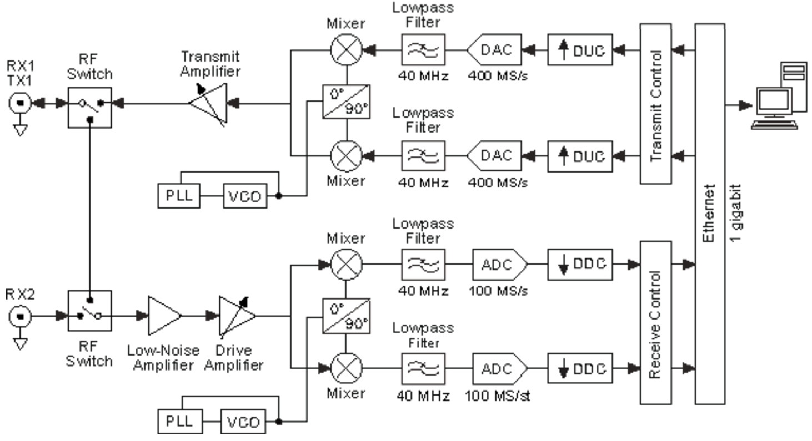

Ettus X310 and Gnuradio
============================
The section explains the Ettus USRP architechture, the GNURadio toolkit and deals with topics such as sampling rates and master clock rates.
Installation instructions for e.g GNURadio can also be found.
Most of the following information can be applied to other Ettus USRP devices.

The Ettus USRP
--------------
Ettus Research and the National instruments company
provides a broad product line of SDR platforms with e.g
different frequency coverage and bandwidths [4]. The Ettus
USRP X3x0 series is currently the most high performing
platform and would be the most suitable for radio systems
with high demands on bandwidth and accuracy. The
provided General Purpose Input Output (GPIO) interface
in the x3x0 series also makes implementations of Dicke-switching
an easier task, and as we shall see is fundamental for the FFTS described here.
A general USRP architecture is
provided in the figure below, specifics may vary depending on the
model [5].

	
	A general Ettus USRP architecture demonstrating
	the signal chain and processing performed. Based on
	the Ettus N210 with daughterboard WBX [5].
	
The first part of the receiver (RX) chain consist of a fundamental
Low Noise Amplifier (LNA) with variable attenuation
exposed in software e.g GNURadio. The signal
is further modulated into inphase and quadrature signals
I and Q. Analog and Digital (A/D) converters handles
the discretization of the RF providing a bandwidth determined
by the daughterboard i.e the front-end of the Ettus
USRP [2]. The onboard FPGA down converts the signal
by an Digital Down Converter (DDC) implementation providing fine frequency
tuning and filters for decimation. The data is
subsequently exposed to the host computer through Ethernet
or PCIe interfaces.

PCIe interface
--------------
The PCIe interface provides high data throughput together with low latency, where the latter is a important part
for Dicke-switched purposes due to the importance of deterministic timings. However the 10 Gbit ethernet interface
provides higher throughput.

Installation
'''''''''''''
The latest PCIe driver can be downloaded `here. <http://files.ettus.com/manual/page_ni_rio_kernel.html#linux_rio>`_
Follow the instructions at the site to install the driver. This simply involves unpacking the software and running the install script followed by a reboot.
Se the manual on how to disable and enable the PCIe drivers. Navigate to http://files.ettus.com for older versions of the driver.

Sampling rates
--------------
The x3x0 series delivers up to 200 M samples/s (I/Q), thus your host computer might have trouble keeping up to speed.
Overflow, lost samples, is indicated by a an O in the terminal and is an indication that there is a bottle neck at your host.
Several things can be done to address this issue.

First of all is to check that your hardware is up to speed. Check the CPU load, RAM usage and not least the harddrive. A mechanical drive would allow a sample rate up to about 30 Mhz of I/Q sampling
depending on the harddrive. The other option would be to use a SSD and it can get you alot higher, however I experienced quite alot of performance issues when running under Linux, with write speeds way below the specifications.
I eventually abandoned the SSD and right now I am using Ramdisk, which in theory should have no problem whatsoever for a complex sample rate of 200Mhz (800MB/s).

Other host side improvements that can be done is to expand the socket buffers, setting the governors for your CPU to run at maximum performance and several other parameters.
More information and instructions on this can be found `here. <https://github.com/EttusResearch/uhd/blob/master/host/docs/usrp_x3x0_config.dox>`_

If perfomance issues is still a problem go back to the base of your application and check for issues there.
There is also another option, which is FPGA programming. Go to this section for more information.

Sampling rate decimations
'''''''''''''''''''''''''
There are several half band filters incorporated in the Ettus X310 device and some decimations may result in all of them not being activated.
Those decimations are the uneven ones. For example a sampling frequency of 50 Mhz = 200 Mhz / 4 will have all the half band filters activated.

Master Clock Rates
''''''''''''''''''
The Ettus x310 currently support three different Master Clock Rates; 200Mhz (Default), 184.32Mhz and 120Mhz.
In practice this means that other even sampling rate decimations can be achieved, allowing for better filter trade-off.
The Master Clock Rate can be set in the GnuRadio application, see Code explanation for details.

GNU Radio
---------
The software interface GNU Radio performs signal processing
through the use of dedicated blocks, e.g. infinite
impulse response filters (IIR) or FFT calculations,
designed in C++. The signal processing blocks can be
linked to perform the desired computations in the GNU
Radio Companion (GRC) Graphical User Interface (GUI)
or directly through the use of a programming language
such as Python. GNU Radio provides a vast library of
signal processing blocks that can easily be modified to
custom specifications. GNU Radio is also published under the GNU General Public Licence (GPL), thus making it free to use and modify.

Installation
''''''''''''
From my experience I found that the easiest way to get a USRP device up and running with Gnuradio is to use Marcus Leech installation script. 
It will install both the Ettus UHD software (to interface with the device) and Gnuradio from source. The other approach is to use Pybombs or to do it direcly from source, this is however abit more work.
Marcus Leech script can be found `here. <http://gnuradio.org/redmine/projects/gnuradio/wiki/InstallingGRFromSource>`_

The Python Dicke-switching application presented does, however, require atlatest UHD build 3.8.5 in order to work. This due to the fact that
the GPIO, on the Ettus X310, has only recently been exposed through swig. To update UHD and Gnuradio enter your UHD/Gnuradio directory and perform a git pull on the following repositories::

	https://github.com/EttusResearch/uhd
	https://github.com/gnuradio/gnuradio
	
Then perform the usual compile and install procedure. Alternatively navigate to http://files.ettus.com and download the approriate version.
It is important to update UHD before Gnuradio in order for it to work otherwise GnuRadio will compile without UHD.

Updating the FPGA image
'''''''''''''''''''''''
Different versions of UHD might require another FPGA image in order to function properly. This is also displayed when trying to initiate the device.
To get the FPGA image that corresponds to the current running UHD simply run::

	sudo uhd_images_downloader
	
Thereafter run::

	uhd_image_loader --args="type=x300,resource=RIO0,fpga=HGS"
	
to burn the FPGA image to the device. The above command will automatically identify the correct FPGA image, however the possibility
to specify the path also exist by simply providing the argument --fpga-path="<path>".
If the command fails try instead to navigate to::

	/usr/local/lib/uhd/utils
	
and run::
	
	./usrp_x3xx_fpga_burner --type=HGS --resource=RIO0

to burn the FPGA image. The FPGA can also be loaded using JTAG see files.ettus.com/manual for more information.

Note on UHD and FPGA version
''''''''''''''''''''''''''''
The impact on e.g. overflows as a function bandwidth has a notable dependance on UHD and the loaded FPGA image. 
I have found that several UHD versions will result in overflow at e.g. 120 MHz bandwidth using the PCIe interface whilst other do not.
I have not yet been able to isolate the reason behind this but it as a important note. Currently the GNU Radio FFTS is operating on UHD
version 3.9.1 with the corresponding FPGA image with no overflows at 120 MHz.

Interfacing with JTAG
---------------------
The Ettus X310 has a JTAG interface that can be accessed using standard USB. 
This allows interfacing with several utilites such as the Xilinx design tool softwares. 
This also allows access to the FPGA temperature sensor which, at this time, is only exposed through this interface.

..	figure::  images/gnuradio-logo.png
	:align:	center
	:width:	500px
	:alt:	test

